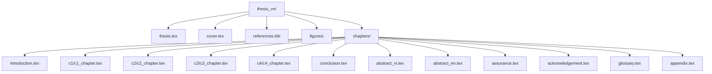

# HƯỚNG DẪN CHUYỂN ĐỔI TOÀN DIỆN KHÓA LUẬN SANG TIẾNG VIỆT (THESIS_VN)
> **Đề tài:** Nghiên cứu, xây dựng hệ thống tóm tắt và kiểm chứng tin tức tiếng Việt sử dụng mô hình ngôn ngữ lớn.  
> **Tác giả:** Lê Văn Thắng (MSV: 22028313)  
> **Giáo viên hướng dẫn:** TS. Vương Thị Hồng  
> **Cơ sở đào tạo:** Trường Đại học Công nghệ — Đại học Quốc gia Hà Nội (UET - VNU)

---

Tài liệu này cung cấp lộ trình thiết kế và chuyển dịch từng bước từ bản khóa luận tiếng Anh hiện tại sang bản tiếng Việt hoàn chỉnh trong thư mục mới `thesis_vn`. Bản chuyển dịch này được thiết kế để tuân thủ nghiêm ngặt các quy định về hình thức trình bày và định dạng cấu trúc theo **Quy định khóa luận tốt nghiệp chính thức của Trường Đại học Công nghệ (UET - VNU)** tại `thesis/guideline.pdf`.

---

## 🗺️ BẢN ĐỒ CẤU TRÚC THƯ MỤC DI TRÚ (EN ➔ VN)

Để đảm bảo tính nhất quán và dễ dàng bảo trì, cấu trúc thư mục của `thesis_vn` sẽ phản ánh chính xác cấu trúc cũ nhưng được đặt tên và cấu hình bằng tiếng Việt:



---

## 📐 PHẦN 1. THIẾT LẬP ĐỊNH DẠNG LATEX CHUẨN UET
Bản gốc tiếng Anh đang sử dụng một số thiết lập lề và tiêu đề không hoàn toàn khớp với quy chuẩn căn lề lọt lòng (binding) và quy định phông chữ của UET. Bạn cần hiệu chỉnh file cấu hình `thesis.tex` như sau:

### 1. Căn lề chuẩn (Geometry)
> [!IMPORTANT]
> Quy định UET yêu cầu lề trái rộng hơn hẳn (3.5 cm) để đóng bìa gáy xoắn hoặc keo nhiệt mà không bị lẹm vào chữ. Các lề khác cần cân đối.

Hiệu chỉnh gói `geometry` ở dòng 20 của `thesis.tex`:
```latex
% Bản cũ tiếng Anh:
% \usepackage[left=3cm,right=2cm,top=2.5cm,bottom=3cm]{geometry}

% Bản mới tiếng Việt chuẩn UET:
\usepackage[left=3.5cm, right=2.0cm, top=2.5cm, bottom=2.5cm]{geometry}
```

### 2. Định dạng phông chữ & Giãn dòng
*   **Phông chữ:** Times New Roman.
*   **Cỡ chữ thân văn bản:** 13pt (UET cho phép từ 13pt đến 14pt). Dự án hiện tại đang dùng `\changefontsizes{13pt}` thông qua gói `scrextend` — đây là lựa chọn tối ưu.
*   **Giãn dòng (Line spacing):** `1.3` đến `1.5`. Đoạn mã hiện tại đang dùng `\renewcommand{\baselinestretch}{1.3}` — giữ nguyên thiết lập này để văn bản thoáng, dễ đọc và đúng quy chuẩn.
*   **Thụt đầu dòng đoạn văn:** `1.0 cm` hoặc `1.27 cm` (1 tab). Đoạn mã hiện tại đang để `\setlength{\parindent}{0pt}` và `\setlength{\parskip}{0.4em}`. 
    > [!TIP]
    > Khóa luận tiếng Việt học thuật của UET thường yêu cầu thụt đầu dòng dòng đầu tiên của mỗi đoạn văn. Nên đổi thành:
    > ```latex
    > \setlength{\parindent}{1.0cm}
    > \setlength{\parskip}{6pt} % Giãn cách giữa các đoạn văn 6pt
    > ```

### 3. Việt hóa các nhãn mặc định của LaTeX
Khi dùng tiếng Việt với gói `vntex`, một số nhãn tự động sẽ được dịch sẵn. Tuy nhiên, các tiêu đề danh mục đặc thù trong cấu hình cần được sửa thủ công ở phần cấu hình đầu file:

```latex
% Định dạng đầu Chương trong Mục lục (TOC)
\renewcommand{\cftchappresnum}{Chương }
\renewcommand{\cftchapaftersnum}{: }
\AtBeginDocument{\addtolength\cftchapnumwidth{\widthof{\bfseries Chương \ }}}

% Sửa lại nhãn cho Danh mục hình vẽ và Danh mục bảng biểu
\renewcommand{\listfigurename}{DANH MỤC HÌNH VẼ}
\renewcommand{\listtablename}{DANH MỤC BẢNG BIỂU}
```

---

## 📕 PHẦN 2. HƯỚNG DẪN VIỆT HÓA MỤC TRƯỚC NỘI DUNG (FRONT MATTER)

Các mục đầu khóa luận có vai trò pháp lý và hành chính quan trọng, cần chuyển dịch chính xác thuật ngữ hành chính của UET.

### 1. Trang bìa & Phụ bìa (`cover.tex`)
*   **Quy định:** Bìa khóa luận tốt nghiệp UET gồm 2 trang: Trang bìa ngoài (in trên giấy bìa cứng màu xanh) và Trang phụ bìa trong (in trên giấy thường). 
*   **Việt hóa:**
    *   `BACHELOR'S THESIS` ➔ `KHÓA LUẬN TỐT NGHIỆP ĐẠI HỌC`
    *   `Major: Information Technology` ➔ `Ngành: Công nghệ thông tin`
    *   `Supervisor: Dr. Vuong Thi Hong` ➔ `Người hướng dẫn: TS. Vương Thị Hồng`
    *   Khung viền bìa: Giữ nguyên khung viền TikZ đôi sang trọng như bản gốc.

### 2. Lời cam đoan (`assurance.tex`)
*   **Tiêu đề:** `LỜI CAM ĐOAN`
*   **Nội dung chuyển ngữ học thuật:**
    > "Tôi xin cam đoan đây là công trình nghiên cứu của riêng tôi, được thực hiện dưới sự hướng dẫn khoa học của TS. Vương Thị Hồng. Các kết quả nghiên cứu và số liệu thực nghiệm được trình bày trong khóa luận này là hoàn toàn trung thực, khách quan và chưa từng được công bố tại bất kỳ công trình khoa học nào khác. Tôi xin hoàn toàn chịu trách nhiệm về nội dung và tính xác thực của khóa luận này."

### 3. Lời cảm ơn (`acknowledgement.tex`)
*   **Tiêu đề:** `LỜI CẢM ƠN`
*   **Nội dung chuyển ngữ học thuật:**
    *   Cảm ơn giảng viên hướng dẫn (TS. Vương Thị Hồng) đã định hướng phương pháp luận khoa học nghiêm ngặt ("phân biệt giữa một kết quả thực tế và một câu chuyện kể về kết quả đó").
    *   Cảm ơn các thầy cô giáo tại Khoa Công nghệ thông tin, Trường Đại học Công nghệ đã truyền đạt tri thức và kỷ luật kỹ thuật trong suốt 4 năm học.
    *   Cảm ơn 17 người tham gia đánh giá mù (human raters) ở Axis C giúp thu thập dữ liệu có nghĩa.
    *   Cảm ơn gia đình đã luôn đồng hành, động viên và chia sẻ áp lực trong suốt thời gian thực hiện nghiên cứu.

### 4. Tóm tắt khóa luận & Abstract (`abstract_en.tex`)
> [!IMPORTANT]
> Khóa luận tốt nghiệp UET bắt buộc phải có cả bản tóm tắt bằng tiếng Việt (`TÓM TẮT KHÓA LUẬN`) và bản tóm tắt bằng tiếng Anh (`ABSTRACT`). Mỗi bản tóm tắt nên gọn trong đúng 1 trang giấy.

*   Tạo file mới `abstract_vi.tex` cho phần tiếng Việt.
*   Nội dung tóm tắt tiếng Việt cần nhấn mạnh **3 đóng góp lớn** của khóa luận:
    1.  **Đóng góp thực tiễn (Hệ thống Fiber):** Tiện ích mở rộng trình duyệt và hệ thống backend Next.js hỗ trợ tóm tắt thời gian thực (streaming) và kiểm chứng tin tức tự động.
    2.  **Đóng góp kỹ thuật (Sự thích ứng MoA):** Áp dụng pipeline Mixture-of-Agents (Wang et al., 2024) vào việc tóm tắt tiếng Việt có neo ngữ cảnh gốc thông qua kết nối phần dư (source residual connection).
    3.  **Đóng góp phương pháp luận (Framework đánh giá 3 trục - Axis A/B/C):** Chỉ ra thực nghiệm tại sao các hệ số overlap truyền thống (ROUGE/BLEU) lại trừng phạt các mô hình tổng hợp biên tập có chất lượng cao.

### 5. Thuật ngữ và từ viết tắt (`glossary.tex`)
*   **Tiêu đề:** `DANH MỤC KÝ HIỆU VÀ CHỮ VIẾT TẮT`
*   Việt hóa tiêu đề cột bảng `longtable`:
    *   `Abbreviation` ➔ `Chữ viết tắt`
    *   `Full Form / Meaning` ➔ `Nghĩa đầy đủ / Giải thích`
    *   `Term` ➔ `Thuật ngữ`
    *   `Definition` ➔ `Định nghĩa`

---

## 📝 PHẦN 3. BẢNG TRA CỨU THUẬT NGỮ CHUYÊN NGÀNH ANH - VIỆT
Để bản dịch đạt chất lượng học thuật cao nhất, không bị thô ráp hoặc mất đi nghĩa gốc của khoa học máy tính, bạn cần áp dụng đồng bộ bộ thuật ngữ sau trong toàn bộ các chương:

| Thuật ngữ gốc (English) | Thuật ngữ tiếng Việt tiêu chuẩn | Ghi chú ngữ cảnh sử dụng trong khóa luận |
| :--- | :--- | :--- |
| **Large Language Model (LLM)** | Mô hình ngôn ngữ lớn (LLM) | Giữ nguyên từ viết tắt LLM trong ngoặc. |
| **Mixture-of-Agents (MoA)** | Kiến trúc đa tác nhân phối hợp (MoA) | Có thể dịch là "Mô hình hỗn hợp tác nhân". |
| **Proposer** | Tác nhân đề xuất / Mô hình đề xuất | Mô hình tạo bản thảo tóm tắt sơ bộ ở Layer 1. |
| **Aggregator** | Tác nhân tổng hợp / Mô hình tổng hợp | Mô hình ở Layer 2 chịu trách nhiệm biên tập, dung hợp. |
| **Residual Connection** | Kết nối phần dư (Residual Connection) | Việc đưa trực tiếp văn bản gốc vào aggregator context. |
| **Fact-checking / Factuality** | Kiểm chứng thông tin / Tính xác thực | Đánh giá độ tin cậy của bản tóm tắt đối với bài báo gốc. |
| **Retrieval-Augmented Generation** | Tạo văn bản tăng cường truy xuất (RAG) | Giữ nguyên RAG để chuyên nghiệp. |
| **Search-Augmented Generation** | Tạo văn bản tăng cường tìm kiếm (SAG) | Sử dụng công cụ Tavily để tìm minh chứng. |
| **LLM-as-Judge** | Đánh giá bằng mô hình ngôn ngữ lớn | Dùng mô hình (như GPT-4o-mini) để làm giám khảo chấm điểm. |
| **Position Randomization** | Ngẫu nhiên hóa vị trí | Phương pháp chống thiên kiến vị trí (position bias) của LLM. |
| **Length Bias / Length-controlled** | Thiên kiến độ dài / Kiểm soát độ dài | LLM thường thích bài dài; cần kiểm soát bằng bucket. |
| **Inter-rater Agreement** | Độ đồng thuận giữa các người đánh giá | Đo lường bằng hệ số Fleiss' Kappa ($\kappa$). |
| **Draft-stitching** | Chắp vá bản thảo | Hiện tượng aggregator chỉ ghép nối cơ học các bản thảo. |
| **Editorial Synthesis** | Tổng hợp mang tính biên tập | Sự tổng hợp sâu sắc, viết lại mạch lạc từ gốc thông tin. |
| **Content Retention** | Khả năng giữ lại nội dung | Bản chất của các metric Axis A (đo trùng lặp từ vựng). |
| **Methodological Caveat** | Hạn chế phương pháp luận | Chỉ ra lý do vì sao ROUGE/BLEU không đủ để đánh giá. |
| **Entailment / Contradiction** | Kéo theo logic / Mâu thuẫn logic | Kết quả phân loại claim factuality. |
| **Hallucination** | Hiện tượng ảo tưởng thông tin | Mô hình tạo ra thông tin không có trong bài viết gốc. |

---

## 📑 PHẦN 4. HƯỚNG DẪN DỊCH VÀ DI TRÚ CHI TIẾT TỪNG CHƯƠNG

### 📌 Bước 1: Chương Mở đầu (`introduction.tex`) ➔ `mo_dau.tex`
*   **Tiêu đề:** `\chapter*{MỞ ĐẦU}` (Dùng dấu `*` để không đánh số chương, nhưng vẫn thêm vào mục lục).
*   **Các phần chính dịch nghĩa:**
    *   `Rationale` ➔ `Tính cấp thiết của đề tài`: Sự phát triển vũ bão của tin tức trực tuyến tiếng Việt kéo theo hai nhu cầu lớn: (1) Nén thông tin (tóm tắt nhanh) và (2) Xác thực thông tin (tránh tin giả, clickbait).
    *   `Scientific and Practical Significance` ➔ `Ý nghĩa khoa học và thực tiễn`:
        *   *Ý nghĩa khoa học:* Framework đánh giá 3 trục chỉ ra hạn chế của metric overlap từ vựng đối với các mô hình tổng hợp biên tập.
        *   *Ý nghĩa thực tiễn:* Sản phẩm Fiber chạy trực tiếp trên Chromium-based browsers, tích hợp Next.js, FastAPI BERTScore và Tavily API.
    *   `Research Objectives` ➔ `Mục tiêu nghiên cứu`: (1) Thiết kế hệ thống extension real-time, (2) Thích ứng Mixture-of-Agents cho tóm tắt tiếng Việt nối phần dư, (3) Đánh giá và kiểm chứng thực nghiệm framework 3 trục.
    *   `Scope and Object of Study` ➔ `Đối tượng và phạm vi nghiên cứu`:
        *   *Đối tượng:* Tin tức tiếng Việt từ 7 trang báo chính; tập dữ liệu thực nghiệm gồm 154 bài báo từ *Tien Phong*.
        *   *Phạm vi:* 3 mô hình proposers (GPT-4o-mini, Claude Haiku 4.5, Gemini 2.5 Flash), 1 aggregator (GPT-4o), microservice BERTScore với PhoBERT-base.
    *   `Research Methodology` ➔ `Phương pháp nghiên cứu`: Thực nghiệm so sánh định lượng và định tính đa chiều; kiểm định thống kê Sign-test và Fleiss' $\kappa$.
    *   `Outline of the Thesis` ➔ `Bố cục khóa luận`: Mô tả tóm tắt nội dung 4 chương tiếp theo.

---

### 📌 Bước 2: Chương 1 - Tổng quan (`c1_chapter.tex`) ➔ `chapters/c1/c1_chapter.tex`
*   **Tiêu đề:** `\chapter{Tổng quan}`
*   **Việt hóa các tiêu đề tiểu mục:**
    *   `1.1. Automatic Text Summarization` ➔ `1.1. Bài toán tóm tắt văn bản tự động`
    *   `1.2. News Fact-Checking` ➔ `1.2. Bài toán kiểm chứng tin tức`
    *   `1.3. Mixture-of-Agents (MoA)` ➔ `1.3. Phương pháp Mixture-of-Agents (MoA)`
    *   `1.4. Related Works` ➔ `1.4. Các công trình liên quan`
*   **Điểm nhấn ngôn từ học thuật:**
    *   Phân tích sâu sắc **thách thức đặc thù của tiếng Việt** (Dòng 35): Từ ghép đa âm tiết (word segmentation), thanh điệu (diacritics/tones), và đặc biệt là sự thiếu hụt các corpus chuẩn có tóm tắt do con người viết (scarcity of reference corpora), giải thích lý do tại sao nghiên cứu tiếng Việt thường phải đo overlap trực tiếp với văn bản gốc.
    *   Giải thích nguyên lý hoạt động của pipeline kiểm chứng 3 bước tiêu chuẩn: Trích xuất tuyên bố (Claim detection) ➔ Truy xuất minh chứng (Evidence retrieval) ➔ Phán quyết độ tin cậy (Verdict prediction).

---

### 📌 Bước 3: Chương 2 - Cơ sở lý thuyết (`c2_chapter.tex`) ➔ `chapters/c2/c2_chapter.tex`
*   **Tiêu đề:** `\chapter{Cơ sở lý thuyết}`
*   **Việt hóa các tiêu đề tiểu mục:**
    *   `2.1. Large Language Models` ➔ `2.1. Các mô hình ngôn ngữ lớn`
    *   `2.2. Summarization Evaluation Metrics (Axis A)` ➔ `2.2. Các hệ đo lường đánh giá tóm tắt (Trục A)`
    *   `2.3. LLM-as-Judge Methodology (Axis B)` ➔ `2.3. Phương pháp luận Đánh giá bằng LLM (Trục B)`
    *   `2.4. Factuality Evaluation` ➔ `2.4. Đánh giá tính xác thực của thông tin`
    *   `2.5. Human Evaluation & Inter-rater Agreement (Axis C)` ➔ `2.5. Đánh giá con người và độ đồng thuận (Trục C)`
    *   `2.6. Content Extraction` ➔ `2.6. Trích xuất nội dung bài báo`
    *   `2.7. Search-Augmented Generation for Fact-Checking` ➔ `2.7. Tạo văn bản tăng cường tìm kiếm phục vụ kiểm chứng`
    *   `2.8. Browser Extension Development` ➔ `2.8. Công nghệ phát triển tiện ích mở rộng trình duyệt`
*   **Công thức Toán học & Bảng số liệu:**
    *   Giữ nguyên toàn bộ các công thức toán học định nghĩa Attention (Dòng 18), ROUGE (Dòng 76), BLEU (Dòng 98), Sign-test (Dòng 180).
    *   Việt hóa bảng phân mức độ đồng thuận Fleiss' Kappa ($\kappa$) của Landis-Koch (Dòng 249):
        *   `< 0` ➔ `Tệ hơn ngẫu nhiên`
        *   `0.00 - 0.20` ➔ `Đồng thuận rất ít (Slight)`
        *   `0.21 - 0.40` ➔ `Đồng thuận vừa phải (Fair)`
        *   `0.41 - 0.60` ➔ `Đồng thuận trung bình (Moderate)`
        *   `0.61 - 0.80` ➔ `Đồng thuận đáng kể (Substantial)`
        *   `0.81 - 1.00` ➔ `Đồng thuận gần như tuyệt đối (Almost perfect)`

---

### 📌 Bước 4: Chương 3 - Thiết kế và xây dựng hệ thống (`c3_chapter.tex`) ➔ `chapters/c3/c3_chapter.tex`
> [!IMPORTANT]
> Đây là chương nặng về kỹ thuật và kiến trúc hệ thống của bạn. Hãy đảm bảo các từ khóa công nghệ (Next.js, Plasmo, Supabase, API, DOM...) được viết đúng hoa/thường và các sơ đồ kiến trúc được giải thích mạch lạc.

*   **Tiêu đề:** `\chapter{Thiết kế và xây dựng hệ thống}`
*   **Các tiểu mục cốt lõi cần dịch kỹ:**
    *   `3.1. Requirement Analysis` ➔ `3.1. Phân tích yêu cầu hệ thống` (yêu cầu chức năng và phi chức năng).
    *   `3.2. System Architecture` ➔ `3.2. Kiến trúc tổng quan hệ thống` (Mô tả chi tiết 3 service chính: Extension, Backend API, BERTScore Microservice).
    *   `3.3. Summarization Module` ➔ `3.3. Phân hệ tóm tắt văn bản` (Giải thích cơ chế Routing thông minh dựa trên độ dài và độ phức tạp của bài báo sử dụng ViT5 làm fallback).
    *   `3.4. MoA Output Fusion Pipeline` ➔ `3.4. Pipeline dung hợp kết quả đa tác nhân (MoA)`: **Đây là đóng góp kỹ thuật cốt lõi.** Cần giải thích rõ cơ chế hoạt động của `proposer layer` song song và `aggregator layer` tích hợp kết nối phần dư bài báo gốc để chống ảo tưởng.
    *   `3.5. Fact-Checking Module` ➔ `3.5. Phân hệ kiểm chứng sự kiện` (Quy trình claim-splitting và kiểm tra qua Tavily).
    *   `3.6. Three-Axis Evaluation Framework` ➔ `3.6. Khung đánh giá ba trục (Three-Axis Framework)`: Đóng góp phương pháp luận chính. Giải thích cách lấy dữ liệu tự động cho Trục A, Trục B (giám khảo LLM) và giao diện gom tác vụ Trục C (đánh giá con người).
    *   `3.7. Database Design` ➔ `3.7. Thiết kế cơ sở dữ liệu`: Giải thích chi tiết lược đồ quan hệ Supabase PostgreSQL (các bảng `evaluation_metrics`, `llm_judge_pairwise`, `human_eval_tasks`...).

---

### 📌 Bước 5: Chương 4 - Thực nghiệm và đánh giá (`c4_chapter.tex`) ➔ `chapters/c4/c4_chapter.tex`
> [!TIP]
> Chương này chứa đựng "câu chuyện khoa học" hay nhất của khóa luận: Sự mâu thuẫn giữa điểm overlap (Trục A) và đánh giá thông minh (Trục B/C). Hãy chuyển dịch với văn phong lập luận sắc bén, khách quan.

*   **Tiêu đề:** `\chapter{Thực nghiệm và đánh giá}`
*   **Lập luận cốt lõi về "Nghịch lý MoA" (MoA Paradox) cần dịch thoát ý:**
    > "Khi mô hình tổng hợp (aggregator) có bài viết gốc làm tham chiếu ngữ cảnh (residual connection), nó sẽ chuyển hướng hành vi từ ghép nối cơ học (draft-stitching) sang biên tập chuyên sâu (editorial synthesis). Bản tóm tắt lúc này sẽ cô đọng hơn, viết lại mạch lạc theo văn phong báo chí chuẩn thay vì cố giữ nguyên cụm từ gốc của các bản thảo. Sự viết lại sáng tạo và cô đọng này tự động làm giảm tỷ lệ trùng lặp từ vựng trực tiếp. Do đó, các hệ số overlap truyền thống như ROUGE và BLEU sẽ trừng phạt (cho điểm thấp) chính xác những cải tiến chất lượng biên tập mà người dùng và giám khảo LLM đánh giá cao."
*   **Báo cáo kết quả then chốt (Thesis-decisive):**
    *   Dung hợp MoA chiến thắng mô hình đơn lẻ mạnh nhất (GPT-4o-alone) với tỷ lệ áp đảo **77.1%** trên 48 bài báo thực nghiệm có ý nghĩa thống kê cực kỳ cao ($p = 0.0002$).
    *   Sự nhất quán giữa điểm chất lượng chi tiết Rubric (Trục B) và đánh giá của con người (Trục C).

---

### 📌 Bước 6: Chương Kết luận (`conclusion.tex`) ➔ `chapters/conclusion.tex`
*   **Tiêu đề:** `\chapter{Kết luận và hướng phát triển}`
*   **Các phần dịch:**
    *   `Summary of Contributions` ➔ `Tóm tắt các đóng góp`: Tái khẳng định hệ thống Fiber hoàn chỉnh, pipeline MoA tối ưu cho tiếng Việt, và phát hiện khoa học về giới hạn của hệ thống đánh giá một trục.
    *   `Limitations` ➔ `Hạn chế của đề tài`: Tập dữ liệu đơn miền (*Tien Phong*), hệ số Fleiss' Kappa của con người bị ảnh hưởng bởi độ mỏi nhận thức, mô hình giám khảo có nguy cơ tự ưu ái (self-preference).
    *   `Future Work` ➔ `Hướng phát triển tương lai`: Mở rộng quy mô đánh giá con người, ứng dụng các mô hình ngôn ngữ lớn tiếng Việt bản địa (local Vietnamese LLMs), tích hợp RAG vào từng tác nhân đề xuất.

---

### 📌 Bước 7: Phụ lục (`appendix.tex`) ➔ `chapters/appendix.tex`
*   **Tiêu đề:** `\chapter*{PHỤ LỤC}`
*   Việt hóa các tiêu đề phụ lục:
    *   `Appendix A: Summarization Examples` ➔ `Phụ lục A: Minh họa tóm tắt văn bản` (Bài báo vụ nữ sinh lớp 8 Nghệ An bị hành hung).
    *   `Appendix B: Fact-Checking Examples` ➔ `Phụ lục B: Minh họa kiểm chứng thông tin` (Chuyến thăm Trung Quốc của Thủ tướng Phạm Minh Chính).
    *   `Appendix C: Aggregator Prompt Engineering Ablation` ➔ `Phụ lục C: Thử nghiệm kỹ nghệ gợi ý đối với mô hình tổng hợp` (So sánh các biến thể Baseline, v1-strict, v2-soft).

---

## 📚 PHẦN 5. QUY CHUẨN TRÍCH DẪN & TÀI LIỆU THAM KHẢO

Khóa luận UET yêu cầu tài liệu tham khảo phải được tổ chức khoa học:

1.  **Phân loại:**
    *   Nếu có tài liệu tiếng Việt, xếp trước.
    *   Tài liệu tiếng Anh/quốc tế, xếp sau.
2.  **Thứ tự sắp xếp:**
    *   Tài liệu tiếng Việt: Sắp xếp theo thứ tự bảng chữ cái của **Tên** tác giả (không dùng họ để xếp).
    *   Tài liệu tiếng Anh: Sắp xếp theo thứ tự bảng chữ cái của **Họ** tác giả.
3.  **Công cụ quản lý:**
    *   Dự án đang sử dụng gói `biblatex` với backend `biber` và sắp xếp theo năm (`sorting=ynt`).
    *   Để chuyển sang sắp xếp chuẩn học thuật Việt Nam, khuyến nghị đổi cấu hình trong file `thesis.tex`:
    ```latex
    \usepackage[
      backend=biber,
      style=numeric, % Sử dụng kiểu số thứ tự xuất hiện hoặc bảng chữ cái
      sorting=nty    % Sắp xếp theo Name, Title, Year
    ]{biblatex}
    ```

---

## 🛠️ PHẦN 6. QUY TRÌNH BIÊN DỊCH VÀ KIỂM THỬ BẢN DỊCH

Sau khi đã dịch xong toàn bộ các file `.tex` và chuyển vào thư mục `thesis_vn`, hãy thực hiện các bước sau để biên dịch bản PDF tiếng Việt chính thức:

### 1. Dọn dẹp các file rác cũ (nếu có)
```bash
cd "/Users/thanglee/something beautiful/UniThesis/thesis_vn"
rm -f *.aux *.bbl *.bcf *.blg *.lof *.log *.lot *.out *.run.xml *.toc *.synctex.gz
```

### 2. Thực hiện biên dịch chuỗi bằng `pdflatex` và `biber`
Để đảm bảo tất cả các tham chiếu chéo (cross-references), mục lục, danh mục hình vẽ và tài liệu tham khảo được cập nhật chính xác, bạn cần chạy lệnh biên dịch theo chu kỳ:

```bash
# Lần 1: Tạo các file aux, bcf làm cơ sở cho trích dẫn
pdflatex thesis.tex

# Lần 2: Biên dịch tài liệu tham khảo từ references.bib
biber thesis

# Lần 3: Cập nhật chỉ số trích dẫn vào văn bản chính
pdflatex thesis.tex

# Lần 4: Chốt số trang và mục lục chuẩn cuối cùng
pdflatex thesis.tex
```

---

## 🏁 BẢNG KIỂM TRA CHẤT LƯỢNG CUỐI CÙNG (QA CHECKLIST)

Trước khi gửi bản dịch khóa luận tiếng Việt cho Giáo viên hướng dẫn, hãy kiểm tra danh sách sau:
- [ ] **Lề văn bản:** Trái 3.5 cm, Phải 2.0 cm, Trên 2.5 cm, Dưới 2.5 cm.
- [ ] **Đánh số trang:** Trang bìa và phụ bìa không đánh số. Mục trước nội dung dùng chữ số La Mã thường (`i, ii, iii...`) ở giữa dưới. Nội dung chính dùng chữ số Ả Rập (`1, 2, 3...`) bắt đầu từ phần `MỞ ĐẦU` (trang số 1).
- [ ] **Hình vẽ & Bảng biểu:** Tên Hình nằm DƯỚI hình. Tên Bảng nằm TRÊN bảng. Tất cả đều được dịch sang tiếng Việt (Ví dụ: `Hình 3.1` thay vì `Figure 3.1`).
- [ ] **Thuật ngữ học thuật:** Nhất quán trong toàn bộ tài liệu (ví dụ: dùng thống nhất "kiến trúc đa tác nhân phối hợp" hoặc "Mixture-of-Agents").
- [ ] **Mục lục:** Cập nhật chính xác số trang mới sau khi dịch (tiếng Việt thường dài hơn tiếng Anh khoảng 10-15%).

---
Chúc bạn thực hiện dịch thuật và hoàn thiện khóa luận tốt nghiệp xuất sắc để đạt điểm số cao nhất tại hội đồng bảo vệ UET!
